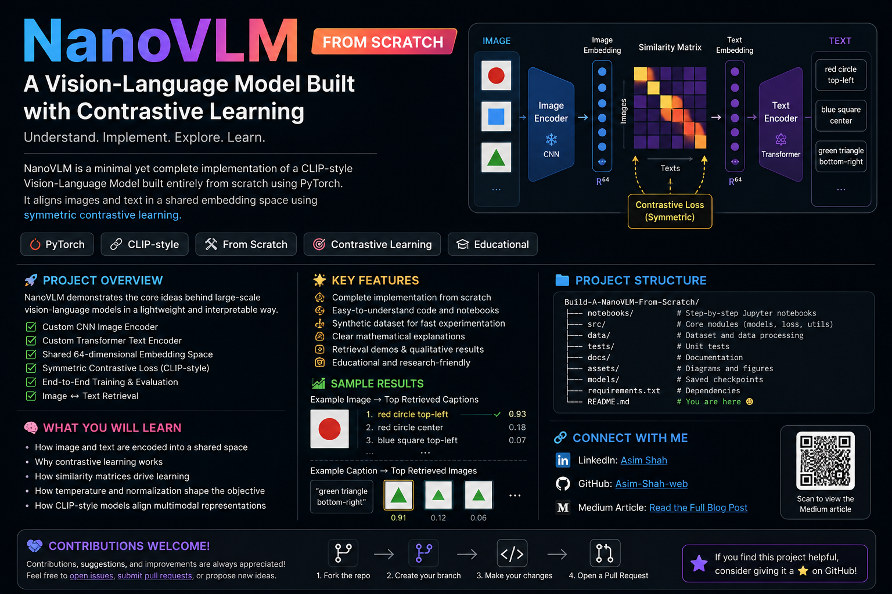

# 🚀 NanoVLM — A Vision-Language Model Built from Scratch


<p align="center"><b>Understand. Implement. Explore. Learn.</b></p>

<p align="center">
  
  
  
  
</p>
<p align="center">
  
</p>

## 📌 About the Project

**NanoVLM** is a small, educational Vision-Language Model built from scratch to understand the core ideas behind modern multimodal learning.

The project focuses on the CLIP-style idea of learning a **shared embedding space** for images and text. An image encoder converts an image into an embedding, while a text encoder converts its corresponding caption into another embedding. **Contrastive learning** teaches the model to bring matching image-text pairs closer together and push non-matching pairs apart.

The goal is not to reproduce a production-scale VLM, but to make the important ideas **small, transparent, mathematical, and executable**.

---

## 🎯 What This Project Teaches

- 🖼️ Image representation and the Image Encoder
- 📝 Text tokenization and the Text Encoder
- 🔗 Shared image-text embedding spaces
- 📐 Embedding normalization and cosine similarity
- 📊 Similarity matrices
- 🌡️ Temperature scaling
- 🎯 Positive and negative pairs
- 🧮 Contrastive probability
- ↔️ Image-to-text loss
- ↕️ Text-to-image loss
- ⚖️ Symmetric CLIP-style contrastive loss
- 🧠 Mathematical intuition behind contrastive learning
- 🔥 End-to-end training
- 🔎 Image-to-text and text-to-image retrieval

---

## 🧠 Core Idea

The central idea of NanoVLM is simple:

> **Learn a shared space where an image and its matching text are close, while unrelated image-text pairs are far apart.**

For an image \(I\) and text \(T\):

\[
z_I = f_{image}(I)
\]

\[
z_T = f_{text}(T)
\]

After normalization, their similarity can be computed with a dot product / cosine similarity:

\[
s_{ij}=z_{I_i}^{T}z_{T_j}
\]

For a batch of paired examples, these similarities form a **similarity matrix**. The correct image-text pairs lie on the diagonal, and contrastive learning trains the model to make those diagonal similarities larger than the off-diagonal similarities.

The symmetric objective combines both directions:

\[
\mathcal{L}=\frac{1}{2}\left(\mathcal{L}_{I\rightarrow T}+\mathcal{L}_{T\rightarrow I}\right)
\]

---

## 🏗️ Architecture

```text
                 IMAGE
                   │
                   ▼
          ┌─────────────────┐
          │  Image Encoder  │
          │      CNN        │
          └────────┬────────┘
                   │
                   ▼
           Image Embedding
                   │
                   │
                   ▼
          ┌─────────────────┐
          │ Shared Embedding│
          │      Space      │
          └─────────────────┘
                   ▲
                   │
           Text Embedding
                   ▲
                   │
          ┌────────┴────────┐
          │  Text Encoder   │
          │   Transformer   │
          └────────┬────────┘
                   ▲
                   │
                  TEXT

             Image ↔ Text
              Similarity
                   │
                   ▼
           Similarity Matrix
                   │
                   ▼
       Symmetric Contrastive Loss
                   │
                   ▼
                Training
```

---

## 📚 Notebook Roadmap

| Stage | Topic |
|---|---|
| 00 | Theoretical Foundations |
| 01 | Dataset Preparation |
| 02 | DataLoader |
| 03 | Image Encoder |
| 04 | Text Encoder |
| 05 | Contrastive Loss |
| 06 | Training |
| 07 | Evaluation / Retrieval |

The notebooks are intentionally structured as a learning path: **understand the concept → implement it → test it → connect it to the complete model**.

---
## 📂 Project Structure

```text
NanoVLM/
│
├── 📁 artifacts/              # Generated outputs, logs, plots, and results
│
├── 📁 assets/                 # Images, diagrams, and visual resources
│
├── 📁 checkpoints/            # Saved model checkpoints
│
├── 📁 configs/                # Configuration files and hyperparameters
│
├── 📁 nano-vlm/               # Main project package / implementation
│
├── 📁 notebooks/              # Step-by-step Jupyter notebooks
│   ├── 00_theoretical_foundations.ipynb
│   ├── 01_dataset.ipynb
│   ├── 02_dataloader.ipynb
│   ├── 03_image_encoder.ipynb
│   ├── 04_text_encoder.ipynb
│   ├── 05_contrastive_loss.ipynb
│   └── 06_training.ipynb
│
├── 📁 src/                    # Reusable source code
│
├── 📄 .gitignore              # Git ignore rules
├── 📄 README.md               # Project documentation
└── 📄 requirements.txt        # Python dependencies

## ⚙️ Installation

Create and activate your Python environment, then install the dependencies:

```bash
pip install -r requirements.txt
```

Launch Jupyter with:

```bash
jupyter notebook
```

or:

```bash
jupyter lab
```

---

## ▶️ Running the Project

Recommended order:

1. Read the theoretical foundations.
2. Prepare / inspect the dataset.
3. Build and test the DataLoader.
4. Implement the Image Encoder.
5. Implement the Text Encoder.
6. Implement the Contrastive Loss.
7. Train the complete NanoVLM.
8. Evaluate retrieval performance.
9. Experiment with the architecture and hyperparameters.

---

## 🔬 Why Contrastive Learning?

Instead of simply asking the model to predict a class, contrastive learning asks:

> **Which text belongs with this image?**

For a batch of \(N\) image-text pairs, every image is compared against every text. The matching pair should receive the highest similarity, while the non-matching pairs act as negatives.

This creates a powerful learning signal using paired image-text data and gives the model a natural way to perform cross-modal retrieval.

---

## 🧪 Things You Can Experiment With

Try changing:

- Embedding dimension
- CNN architecture
- Transformer depth
- Number of attention heads
- Batch size
- Learning rate
- Temperature
- Number of epochs
- Dataset size
- Data augmentation
- Tokenization strategy
- Projection layers

Then observe how these changes affect the training loss and retrieval results.

---

## 📖 Detailed Medium Article

I wrote a detailed article that accompanies this project and goes deeper into **Vision-Language Models, shared embedding spaces, similarity matrices, contrastive learning, and the mathematical intuition behind the loss**.

### [Read the full article](https://medium.com/@asimshahicp/building-a-nanovlm-from-scratch-understanding-vision-language-models-and-contrastive-learning-9715c7924d14)

The notebooks focus on implementation, while the article focuses more deeply on the intuition and mathematics behind the implementation.

---

## 👨‍💻 Connect With Me

- **LinkedIn — Asim Shah:** https://www.linkedin.com/in/asim-shah-ai-dev/
- **GitHub — Asim-Shah-web:** https://github.com/Asim-Shah-web

---

## 🤝 Contributions Are Welcome!

This is an educational project, so **contributions, corrections, improvements, experiments, and suggestions are very welcome**.

You can contribute by:

- 🐛 Fixing bugs
- 📚 Improving explanations
- 🧮 Improving mathematical explanations
- 🧠 Suggesting better architectures
- ⚡ Improving training efficiency
- 🧪 Adding experiments
- 📊 Improving evaluation
- 📝 Improving documentation
- 🎨 Adding useful diagrams or visualizations
- 🔍 Adding tests
- 💡 Proposing new ideas

### Contribution workflow

```text
Fork the repository
       ↓
Create a branch
       ↓
Make your changes
       ↓
Test your changes
       ↓
Commit and push
       ↓
Open a Pull Request
```

If you find the project useful, consider ⭐ starring the repository and sharing it with others learning multimodal AI.

---

## 🎓 Educational Purpose

NanoVLM is intentionally small and simplified. It is **not intended to be a production-scale replacement for large Vision-Language Models**.

Instead, it is designed to make the underlying concepts easier to understand by implementing the major components ourselves and connecting the mathematics directly to working code.

The philosophy is:

> **Understand the mathematics → implement the components → train the model → inspect the results.**

---

## ⭐ Final Note

If you are learning about **CLIP, Vision-Language Models, multimodal embeddings, or contrastive learning**, NanoVLM provides a practical path from mathematical intuition to an end-to-end implementation.

**Build small. Understand deeply. Then scale. 🚀**
